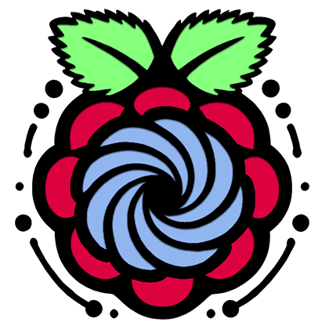

<div align="center">
  
  <h1 align="center">Pico Portal</h1>
  <p align="center">
    Turn your Raspberry Pi Pico W into a portable, powerful Wi-Fi access point with this lightweight captive portal software. 
    Serve web content/pages and display real-time connection info directly on the onboard Pimoroni screen. Log all the connection details for later debugging and use!
  </p>
  <p align="center">
    Whether you're testing networks, showcasing web projects, or exploring IoT, this tool gives you the flexibility to do it all. 
    It’s easily adaptable for various purposes—serve web applications, demo single-page apps (SPAs), or set up captive portals for network security testing.
  </p>
</div>

## Index <a name="index"></a>

- [Preview images](#previews)
- [Hardware](#hardware)
  - [Purchase](#purchase-device)
  - [Build your own](#build-your-own)
- [Firmware Setup](#firmware-setup)
  - [Connecting to PC](#connecting)
  - [Installing Firmware](#installing-firmware)
- [Software Setup](#software-setup)
  - [Installing Software](#installing-software)
  - [User Defined Settings](#user-defined-settings)
  - [Button Functions](#button-functions)
- [Development](#development)
  - [Requirements](#requirements)
  - [Development Setup](#development-setup)
  - [Scripts](#scripts)
- [Licensing](#licensing)
- [Wrapping Up](#wrapping-up)

<!---------------------------------------------------------------------------->
<!---------------------------------------------------------------------------->
<!---------------------------------------------------------------------------->

## Preview images <a name="previews"></a>

### Pico Portal XL

![Pico Portal XL][img-pico-portal-xl-blue]

### Pico Portal Mini

![Pico Portal Mini][img-pico-portal-mini-red]

### Software

![Software Demo][img-software-demo]

<p align="right">[ <a href="#index">Index</a> ]</p>

<!---------------------------------------------------------------------------->
<!---------------------------------------------------------------------------->
<!---------------------------------------------------------------------------->

## Hardware <a name="hardware"></a>

### Purchase device <a name="purchase-device"></a>

You can purchase a fully assembled Pico Portal XL, Pico Portal Mini, or a 3D-printed enclosure/case for your own build from Lambda Guru:

🔗 https://www.lambda.guru/

> ![Info][img-info] **Note:** The 3D print files are available on [Lambda Guru][url-lambda-guru] for a small fee (the first time I've ever charged for models, see my free collection [here][url-free-3d]). The enclosures/cases on Lambda Guru are specifically designed for the parts listed below.

> ![Info][img-info] **Note:** If you'd like to do your own custom build there are other alternative 3D printable cases out there on websites such as [thingiverse][url-thingiverse]. Be sure to show off a picture of your build by submitting a ticket [here][url-new-issue]! Your images will likely be shared on places like the Lambda Guru website or this repository for the community to see!

### Build your own <a name="build-your-own"></a>

To replicate the original Pico Portal devices found on [Lambda Guru][url-lambda-guru], you will need the following:

**Pico Portal XL** parts list:

| Part | Link |
| :--- | :--- |
| Raspberry Pi Pico W | [ThePiHut](https://thepihut.com/products/raspberry-pi-pico-w?variant=41952994787523) |
| Pimoroni Pico Display Pack 2.0 | [Pimoroni](https://shop.pimoroni.com/products/pico-display-pack-2-0) |
| 3D Printed Enclosure (XL) | [Lambda Guru](https://www.lambda.guru/) |
| 1600 mAh LiPo Battery | — |
| LiPo SHIM | [Pimoroni](https://shop.pimoroni.com/products/pico-lipo-shim?variant=32369543086163) |

**Pico Portal Mini** parts list:

| Part | Link |
| :--- | :--- |
| Raspberry Pi Pico W | [ThePiHut](https://thepihut.com/products/raspberry-pi-pico-w?variant=41952994787523) |
| Pimoroni Pico Display Pack | [Pimoroni](https://shop.pimoroni.com/products/pico-display-pack) |
| 3D Printed Enclosure (Mini) | [Lambda Guru](https://www.lambda.guru/) |
| 600 mAh LiPo Battery | — |
| Pico-UPS-B | [Waveshare](https://www.waveshare.com/pico-ups-b.htm) |

> ![Info][img-info] **Note:** This project can be ran standalone on a Raspberry Pi Pico W! Additional hardware is only required for the portable version.

<p align="right">[ <a href="#index">Index</a> ]</p>

<!---------------------------------------------------------------------------->
<!---------------------------------------------------------------------------->
<!---------------------------------------------------------------------------->

## Firmware Setup <a name="firmware-setup"></a>

### Connecting to PC <a name="connecting"></a>

To connect your Raspberry Pi Pico W to your PC for firmware installation, follow these steps:

1. Make sure your Raspberry Pi Pico is not connected to any power source.

2. Hold down the BOOTSEL button on your Pico.

3. Connect the Pico to your computer using a Micro USB cable.

4. Release the BOOTSEL button. The device should appear on your computer as a USB Mass Storage Device.

> ![Info][img-info] **Note:** You only need to do this for Firmware installation. After the firmware is installed, you can connect your Pico to your computer without holding the BOOTSEL button.

### Installing the Pimoroni MicroPython Firmware <a name="installing-firmware"></a>

To install MicroPython on your Raspberry Pi Pico W after [connecting to your computer](#connecting-to-computer), follow these steps:

1. Download the latest Pimoroni Pico W UF2 file "picow-vXX.YY.ZZ-pimoroni-micropython.uf2" from the official releases:

   - https://github.com/pimoroni/pimoroni-pico/releases

2. Connect your Raspberry Pi Pico W to your PC, see [Connecting to PC](#connecting-to-pc).

3. Drag and drop the UF2 file onto the RPI-RP2 drive. This will program the MicroPython firmware onto your Pico.

4. Wait for a few seconds. The board will automatically reboot. Your Pico will now be running MicroPython.

<p align="right">[ <a href="#index">Index</a> ]</p>

<!---------------------------------------------------------------------------->
<!---------------------------------------------------------------------------->
<!---------------------------------------------------------------------------->

## Software Setup <a name="software-setup"></a>

### Installing Software <a name="installing-software"></a>

> ![Info][img-info] **Note:** This project uses Node.js. Make sure you have Node.js installed on your system before proceeding.

1. Install project dependencies:
    
    ```bash
    npm install
    ```

2. Install Thonny IDE:

   - https://thonny.org/

3. Open Thonny IDE and connect to your Raspberry Pi Pico W via USB.

4. Copy the contents from `src/` (this repo) to the root of your Raspberry Pi Pico W using the Thonny IDE.

    > ![Info][img-info] **Note:** Be sure the "src/modules/" is copied and that the folder exists.

5. Unplug your Raspberry Pi Pico W from your computer and connect it to a power source.

6. Your Raspberry Pi Pico W will now boot up and display the Pico Portal interface on the Pimoroni screen.

### User Defined Settings <a name="user-defined-settings"></a>

You can customize the Pico Portal settings by editing the `src/options.py` file. The settings are as follows:

```python
{
    "wifi_ssid": "WiFi",
    "wifi_password": "",
    "wifi_domain": "setup.local",
    "display_type": "DISPLAY_PICO_DISPLAY"
    "enable_timestamps": False,
    "led_brightness": 0.25
}
```

| Setting | Description |
| :------ | :---------- |
| `wifi_ssid` | The SSID of the Wi-Fi network you want to create. |
| `wifi_password` | The password for the Wi-Fi network you want to create. Make sure your password is 8+ characters. Also cycle the power on and off if you change the password to fully update it. Leave blank for an open network (default). |
| `wifi_domain` | The domain name for the captive portal displayed on the connecting device. |
| `display_type` | The type of display you are using. Options are `DISPLAY_PICO_DISPLAY` (default) or `DISPLAY_PICO_DISPLAY_2`. If you don't have a screen, you can use either. |
| `enable_timestamps` | Enable or disable timestamps for the log. |
| `led_brightness` | The brightness of the Pico Display LED, as a range from 0.0 to 1.0. Default is 0.25 (25%), 0 for off. |

### Button Functions <a name="button-functions"></a>

The Pico Portal has four buttons that can be used to interact with the device. The button functions are as follows:

| Button | Function |
| :----- | :------- |
| `A` | Scroll up one line of the displayed log. Hold to scroll up faster. |
| `X` | Scroll down one line of the displayed log. Hold to scroll down faster. |
| `B` | Scroll to the top of the page of the displayed log. |
| `Y` | Scroll to the bottom of the page of the displayed log. |

Button layout:

```bash
 Pico Display       Pico Display 2.0
|=============|  |=====================|
|             |  |   (B)         (A)   |
|  (B)   (A)  |  | ------------------- |
| ----------- |  | |                 | |
| |         | |  | |                 | |
| |         | |  | |                 | |
| |         | |  | |                 | |
| |         | |  | |                 | |
| |         | |  | |                 | |
| ----------- |  | |                 | |
|  (Y)   (X)  |  | ------------------- |
|    (LED)    |  |   (Y)  (LED)  (X)   |
|=============|  |=====================|
```

<p align="right">[ <a href="#index">Index</a> ]</p>

<!---------------------------------------------------------------------------->
<!---------------------------------------------------------------------------->
<!---------------------------------------------------------------------------->

## Development <a name="development"></a>

### Requirements <a name="requirements"></a>

Make sure the following are installed on your system before you begin:

- [Node.js][url-node-js]
- [Python][url-python]
- [Thonny IDE][url-thonny-ide]

### Development Setup <a name="development-setup"></a>

Using a terminal, follow these steps to set up the development environment:

1. Fork and clone the repository:

    ```bash
    git clone
    ```

2. Install project dependencies. This will install the required Node.js packages for running `setup.ts` which will download the required asset files to the `src/modules` folder. Run in the root of the project:

    ```bash
    npm install
    ```

3. Run the python setup script. This will download the files for linting (flake8), formatting (black), and pre-commit hooks (pre-commit). Basically everything we need for enforcing code quality.

    ```bash
    # Install the required packages
    npm run lint:install
    # Install the pre-commit hooks
    pre-commit install
    # Update the pre-commit hooks
    pre-commit autoupdate
    ```

4. Program, test, and debug the project using the Thonny IDE.

5. Commit (pre commit hooks should run and verify the code) and push your changes.

6. Create a pull request [here][url-pull-requests].

Thank you for contributing!

### Scripts <a name="scripts"></a>

| Script | Description |
| :----- | :---------- |
| `format` | Formats the Python code using [Black][url-black]. |
| `lint` | Lints the Python code using Flake8. |
| `lint:install` | Installs the required Python packages for linting and formatting. |
| `postinstall` | Downloads the required asset files to the `src/modules` folder. |

<p align="right">[ <a href="#index">Index</a> ]</p>

<!---------------------------------------------------------------------------->
<!---------------------------------------------------------------------------->
<!---------------------------------------------------------------------------->

## Licensing <a name="licensing"></a>

This project is licensed under the **Creative Commons Attribution-NonCommercial 4.0 International (CC BY-NC 4.0)** License. See the [LICENSE.md](LICENSE.md) file for the pertaining license text.

`SPDX-License-Identifier: CC-BY-NC-4.0`

Basically, everything is free for you to use personally. I just ask that you don't sell this software. If you want to use it for commercial purposes, please contact me first and we can work something out.

Feel free to build this project for yourself, your friends, or your family etc! You can also purchase this device from me directly fully assembled with a case [here](#purchase-device).

Thank you for your understanding!

<p align="right">[ <a href="#index">Index</a> ]</p>

<!---------------------------------------------------------------------------->
<!---------------------------------------------------------------------------->
<!---------------------------------------------------------------------------->

## Wrapping Up <a name="wrapping-up"></a>

Thank you for all of your support, I spent a long time working on this project and plan to support it long term. Really hoping the community joins in and helps me improve it from here. It's important to me that this project stays accessible to everyone, so please keep this software free and open source. If you have any questions, please let me know by opening an issue [here][url-new-issue].

| Type                                                                      | Info                                                                      |
| :------------------------------------------------------------------------ | :------------------------------------------------------------------------ |
|                 | webmaster@codytolene.com                                                  |
|      | https://www.buymeacoffee.com/codytolene                                   |
|  | [bc1qfx3lvspkj0q077u3gnrnxqkqwyvcku2nml86wmudy7yf2u8edmqq0a5vnt][url-btc] |

Fin. Happy programming friend!

Cody Tolene

<!---------------------------------------------------------------------------->
<!---------------------------------------------------------------------------->
<!---------------------------------------------------------------------------->

<!-- IMAGE REFERENCES -->

[img-info]: .github/images/ng-icons/info.svg
[img-pico-portal-mini-red]: .github/images/previews/mini_red.png
[img-pico-portal-xl-blue]: .github/images/previews/xl_blue.png
[img-software-demo]: .github/images/previews/software_demo.gif
[img-warning]: .github/images/ng-icons/warn.svg

<!-- LINK REFERENCES -->

[url-black]: https://pypi.org/project/black/
[url-btc]: https://explorer.btc.com/btc/address/bc1qfx3lvspkj0q077u3gnrnxqkqwyvcku2nml86wmudy7yf2u8edmqq0a5vnt
[url-free-3d]: https://github.com/CodyTolene/3D-Printing
[url-lambda-guru]: https://www.lambda.guru/
[url-new-issue]: https://github.com/CodyTolene/Pico-Portal/issues
[url-node-js]: https://nodejs.org/
[url-pull-requests]: https://github.com/CodyTolene/Pico-Portal/pulls
[url-python]: https://www.python.org/
[url-thingiverse]: https://www.thingiverse.com/
[url-thonny-ide]: https://thonny.org/

<!---------------------------------------------------------------------------->
<!---------------------------------------------------------------------------->
<!---------------------------------------------------------------------------->
