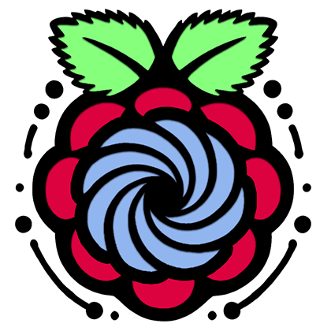
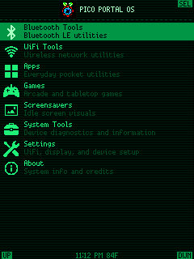
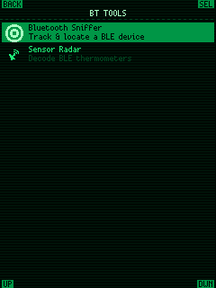
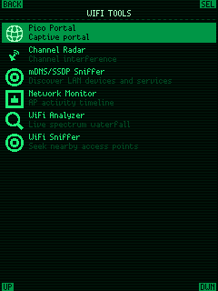
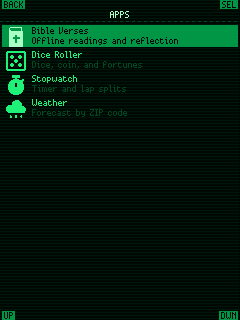
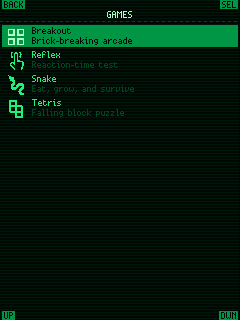
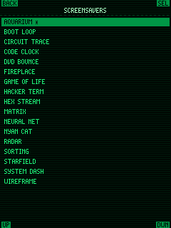
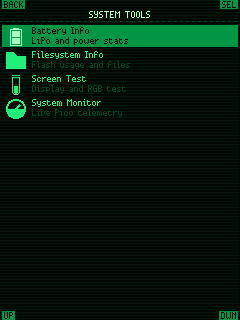
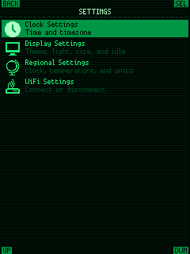
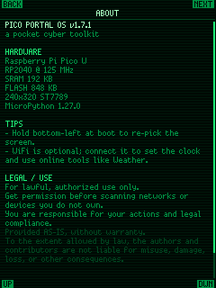

<div align="center">
  
  <h1 align="center">Pico Portal OS</h1>
</div>

## Contents

- [What is Pico Portal OS?](#what-is-pico-portal-os)
- [Previews / Screenshots](#previews--screenshots)
- [Hardware](#hardware)
- [Software Guide](#software-guide)
- [Installation](#installation)
- [Development](#development)
- [License](#license)

## What is Pico Portal OS? <a name="what-is-pico-portal-os"></a>

Pico Portal OS is a compact MicroPython toolkit for the Pico W, packed with
useful tools, diagnostics, games, and utilities.

Take it with you to host an access point, check your network, experiment with
nearby signals, run quick utilities, or just kill a few minutes with a game.

I really wanted to see how much I could get out of my Pico W, and I think I
finally scratched that itch.

## Previews / Screenshots <a name="previews--screenshots"></a>

<table>
  <tr>
    <th>Launcher</th>
    <th>Bluetooth Tools</th>
    <th>WiFi Tools</th>
  </tr>
  <tr>
    <td></td>
    <td></td>
    <td></td>
  </tr>
  <tr>
    <th>Apps</th>
    <th>Games</th>
    <th>Screensavers</th>
  </tr>
  <tr>
    <td></td>
    <td></td>
    <td></td>
  </tr>
  <tr>
    <th>System Tools</th>
    <th>Settings</th>
    <th>About</th>
  </tr>
  <tr>
    <td></td>
    <td></td>
    <td></td>
  </tr>
</table>

## Hardware <a name="hardware"></a>

<details>
  <summary>Pico Portal OS Device</summary>
  
  | Item                           | Description                               |
  | :----------------------------- | :---------------------------------------- |
  | **Raspberry Pi Pico W**        | The main board.                           |
  | **Pimoroni Pico Display Pack** | Works with both the 1.14" and 2.0" packs. |
  | **600 mAh LiPo + Pico-UPS-B**  | Battery setup for the 1.14" device.       |
  | **1600 mAh LiPo + LiPo SHIM**  | Battery setup for the 2.0" device.        |

</details>

<details>
  <summary>Raspberry Pi Pico W</summary>
  
  | Spec        | Detail                                                       |
  | :---------- | :----------------------------------------------------------- |
  | MCU         | RP2040 - dual-core Arm Cortex-M0+ @ up to 133 MHz.           |
  | RAM         | 264 KB SRAM.                                                 |
  | Flash       | 2 MB onboard QSPI flash.                                     |
  | Wireless    | Infineon CYW43439 - 2.4 GHz Wi-Fi 4 (802.11n) + Bluetooth.   |
  | GPIO        | 26 multi-function pins (3.3 V logic - **not** 5 V tolerant). |
  | USB         | Micro-USB, used for power, programming, and the REPL.        |
  | Onboard LED | Driven through the wireless chip - `machine.Pin("LED")`.     |
  | Bluetooth   | Present on the CYW43439.                                     |

</details>

<details>
  <summary>Pimoroni Pico Display Pack</summary>
  
  | Variant               | Resolution | Driver | `config.json` value      |
  | :-------------------- | :--------- | :----- | :----------------------- |
  | Display Pack (1.14")  | 240 × 135  | ST7789 | `DISPLAY_PICO_DISPLAY`   |
  | Display Pack 2.0 (2") | 320 × 240  | ST7789 | `DISPLAY_PICO_DISPLAY_2` |

> ![Info][img-info] **The panel size cannot be auto-detected.** Both packs use
> the same ST7789 controller, so there is no chip ID, ID pin, or API that
> reports the screen size. Because of this, a one-time boot message appears
> which has the user select their screen size, hold the **bottom-left button**
> on boot to re-pick.

> ![Info][img-info] The OS draws everything relative to `graphics.get_bounds()`,
> so the UI scales itself to whichever panel you have.

</details>

<details>
  <summary>Buttons</summary>
  Four buttons, from the Pimoroni Pico Display Pack:

| Physical position | GPIO | The OS action |
| :---------------- | :--- | :------------ |
| Top left          | 13   | Back          |
| Top right         | 12   | Select        |
| Bottom left       | 15   | Up / previous |
| Bottom right      | 14   | Down / next   |

</details>

<details>
  <summary>Known constraints & gotchas </summary>

- **RAM is tight (264 KB).** Keep frame buffers and message history modest. The
  OS redraws the whole screen each frame rather than hoarding state.
- **`Button.read()` is edge-triggered.** It returns `True` a single time per
  physical press. Don't expect a held button to keep returning `True`.
- **3.3 V logic, not 5 V tolerant.** Relevant if you ever add external sensors.
- **The onboard LED goes through the Wi-Fi chip** on the Pico _W_, so it's
  `Pin("LED")`, not a numbered GPIO like on the non-W Pico.
- **Display 2.0 uses the known-good Pico Portal rotation.** The OS initializes
  it with `rotate=270` and an 8-bit framebuffer to fit the Pico's limited RAM.

</details>

## Software Guide <a name="software-guide"></a>

<details>
  <summary>Main Menu</summary>

| Main Menu           | What it does                                       |
| :------------------ | :------------------------------------------------- |
| **Bluetooth Tools** | BLE device discovery, tracking, and sensor data.   |
| **WiFi Tools**      | AP scans, LAN service discovery, and a local AP.   |
| **Apps**            | Bible readings, dice, stopwatch, and weather.      |
| **Games**           | Breakout, Reflex, Snake, and Tetris.               |
| **Screensavers**    | Visuals to preview or use while menus are idle.    |
| **System Tools**    | Power, storage, display, and device diagnostics.   |
| **Settings**        | Clock, display, LEDs, idle saver, units, and WiFi. |
| **About**           | Scrollable system details, tips, and credits.      |

</details>

<details>
  <summary>Bluetooth Tools</summary>
  
  | Bluetooth Tools       | What it does                                    |
  | :-------------------- | :---------------------------------------------- |
  | **Bluetooth Sniffer** | Discover BLE devices and track their RSSI.      |
  | **Sensor Radar**      | Read temperature and humidity from BLE adverts. |

> ![Info][img-info] Bluetooth Sniffer's seek view includes signal bars, a
> radar-style display, an RSSI history trace, and a stronger/weaker trend. These
> indicate signal strength, not a measured distance or direction.

> ![Info][img-info] Sensor Radar displays readings from nearby BLE sensors.
> Cheap BLE sensors put the current temperature and humidity straight into their
> advertising packets, so it decodes the unencrypted formats they broadcast:
> BTHome v2, Xiaomi/Mijia MiBeacon, ATC and pvvx custom firmware, and Govee.
> Nothing is paired, connected to, or requested.

</details>

<details>
  <summary>Wi-Fi Tools</summary>
  
  | Wi-Fi Tools           | What it does                                     |
  | :-------------------- | :----------------------------------------------- |
  | **Pico Portal**       | Host a local AP.                                 |
  | **Channel Radar**     | Count APs by channel; suggest channel 1, 6, 11.  |
  | **mDNS/SSDP Sniffer** | Query devices and services on joined WiFi.       |
  | **Network Monitor**   | Track AP arrivals, losses, and open networks.    |
  | **WiFi Analyzer**     | Plot AP signal levels and channel-count history. |
  | **WiFi Sniffer**      | List nearby APs and track a selected AP's RSSI.  |

> ![Info][img-info] Pico Portal lets you configure the AP name and password,
> choose login and success-page templates, start the portal explicitly, and view
> or clear its bounded submission log.

> ![Info][img-info] Use sample data only for demonstrations. Submitted username
> and password values are stored in `/portal.log` on the device; never enter
> real credentials. You can view or clear that log from Pico Portal.

> ![Info][img-info] The mDNS/SSDP Sniffer lists Chromecasts, printers, speakers,
> and smart plugs on the network you joined. It sends only standard
> service-discovery requests, joins the relevant multicast groups, and
> inventories the responses.

> ![Info][img-info] The WiFi scan tools use 2.4 GHz access-point scan results,
> including SSID, BSSID, channel, RSSI, and security status. The analyzer's
> waterfall and Channel Radar's recommendation are based on AP counts, not
> measured spectrum energy or traffic throughput. WiFi Sniffer's seek view has
> signal bars, a radar-style display, an RSSI trace, and a signal trend.

</details>

<details>
  <summary>Apps</summary>
  
  | Apps             | What it does                                        |
  | :--------------- | :-------------------------------------------------- |
  | **Bible Verses** | Browse, scroll, or randomize offline WEB excerpts.  |
  | **Dice Roller**  | Roll a D6 or D20, flip a coin, or draw a fortune.   |
  | **Stopwatch**    | Start, stop, reset, and keep the latest three laps. |
  | **Weather**      | Current weather and a three-day US ZIP forecast.    |

> ![Info][img-info] Bible Verses streams its curated catalog from flash, keeping
> only the current verse in SRAM. The included modern-English excerpts use the
> public-domain [World English Bible](https://ebible.org/engwebp/copyright.htm).
> It's a fun example on how to add your own books & text to your device for
> reading.

> ![Info][img-info] Weather requires a WiFi connection selected in WiFi
> Settings. The other Apps work offline.

> ![Info][img-info] Weather uses a compact Zippopotam US ZIP lookup followed by
> the key-free [Open-Meteo forecast API](https://open-meteo.com/en/docs).

</details>

<details>
  <summary>Games</summary>
  
  | Games        | What it does                                         |
  | :----------- | :--------------------------------------------------- |
  | **Breakout** | Move a paddle, bounce the ball, and clear bricks.    |
  | **Reflex**   | Measure reaction time and track your session best.   |
  | **Snake**    | Eat food and grow while avoiding walls and yourself. |
  | **Tetris**   | Move and rotate falling blocks to clear full rows.   |

</details>

<details>
  <summary>Screensavers</summary>
  
  | Screensavers      | What it does                                   |
  | :---------------- | :--------------------------------------------- |
  | **Aquarium**      | Swimming pixel fish and rising bubbles.        |
  | **Boot Loop**     | Simulated retro BIOS and boot messages.        |
  | **Circuit Trace** | Animated paths resembling circuit traces.      |
  | **Code Clock**    | Local time and timezone over hexadecimal code. |
  | **DVD Bounce**    | A DVD logo bouncing off the screen edges.      |
  | **Fireplace**     | Animated pixel flames.                         |
  | **Game of Life**  | Conway's cellular automaton.                   |
  | **Hacker Term**   | Simulated scrolling terminal commands.         |
  | **Hex Stream**    | Scrolling generated hexadecimal values.        |
  | **Matrix**        | Falling columns of phosphor glyphs.            |
  | **Neural Net**    | Pulsing nodes and connections.                 |
  | **Nyan Cat**      | A pixel cat flying with a rainbow trail.       |
  | **Radar**         | A rotating sweep with simulated contacts.      |
  | **Sorting**       | Animated bubble sorting of bars.               |
  | **Starfield**     | Stars moving toward the viewer.                |
  | **System Dash**   | Real CPU temperature, RAM, flash, and uptime.  |
  | **Wireframe**     | A moving perspective grid.                     |

> ![Info][img-info] Selecting a screensaver previews it and saves it as the idle
> default. Any button exits the animation. Display Settings can disable
> automatic activation or set a 60, 120, or 300 second menu idle timeout.

</details>

<details>
  <summary>System Tools</summary>
  
  | System Tools        | What it does                                    |
  | :------------------ | :---------------------------------------------- |
  | **Battery Info**    | Power source, voltage, and estimated charge.    |
  | **Filesystem Info** | Flash usage, file/directory counts, sizes.      |
  | **Screen Test**     | Test screen colors and RGB LED effects.         |
  | **System Monitor**  | CPU temperature, RAM, flash, power, and uptime. |

> ![Info][img-info] Battery Info chooses its hardware profile from
> `display.type`: Pico-UPS-B for 1.14", LiPo SHIM for 2.0". Available voltage
> and current readings depend on that hardware. Charge percentage is estimated
> from voltage rather than measured by a fuel gauge. LiPo SHIM cell voltage and
> percentage are unavailable while USB is attached.

</details>

<details>
  <summary>Settings</summary>
  
  | Settings              | What it does                                  |
  | :-------------------- | :-------------------------------------------- |
  | **Clock Settings**    | Choose timezone, automatic DST, and NTP sync. |
  | **Display Settings**  | Theme, text size, lights, and idle saver.     |
  | **Regional Settings** | 12/24-hour time, C/F, and imperial/metric.    |
  | **WiFi Settings**     | Scan, join, disconnect, or forget WiFi.       |

> ![Info][img-info] Clock Settings offers US timezone presets and UTC. Syncing
> requires joined WiFi.

> ![Info][img-info] Display Settings controls scanlines, screen and RGB LED
> brightness, status LED behavior, text size, and screensaver choice and
> timeout.

</details>

<details>
  <summary>About</summary>
  
  | About                  | What it does                              |
  | :--------------------- | :---------------------------------------- |
  | **System Information** | OS version, hardware, firmware, and tips. |
  | **Legal / Use**        | Usage guidance and warranty information.  |
  | **Built By**           | Author credit and CC-BY-NC-4.0 license.   |

> ![Info][img-info] Notice: Use these tools to survey **your own** airspace.

</details>

## Installation <a name="installation"></a>

<details>
  <summary>Install Firmware</summary>

The device runs the **Pimoroni MicroPython** UF2, not vanilla MicroPython. That
build bundles the C modules the OS relies on:

- `picographics` - the `PicoGraphics` drawing API (pens, shapes, text, fonts).
- `pimoroni` - `Button`, `RGBLED`, and other helpers.
- `machine`, `uasyncio`, `time`, `random`, `json` - standard MicroPython.

Grab the latest `picow` UF2 from
<https://github.com/pimoroni/pimoroni-pico/releases> and flash it by holding
**BOOTSEL** while plugging in, then dragging the UF2 onto the `RPI-RP2` drive.

</details>

<details>
  <summary>Build Pico Portal OS</summary>

Using Python 3.9+, install an `mpy-cross` release compatible with the
MicroPython version in your Pimoroni firmware, then build:

```bash
python -m pip install mpy-cross
python -B .scripts/build.py
```

Upload the contents of `dist/` to the Pico root.

</details>

<details>
  <summary>Install Pico Portal OS</summary>
  
  Using [Thonny](https://thonny.org/) (or
   `mpremote`), copy the _contents_ of `dist/` (see
   "Build Pico Portal OS") to the root of the Pico:

Keep `config.json` at the device root. It contains all settings, and can be
edited from your machine.

```text
Pico (/)
├── main.py
├── config.json
├── pico-portal-os/
└── templates/
```

Unplug and replug, or hit the reset.

> ![Info][img-info] Notice: Keep `.pyc` files and `__pycache__/` folders out of
> uploads, they break Thonny uploads to the Pico.

> ![Info][img-info] Copying `config.json` replaces saved settings and WiFi
> credentials. Back up the device's config before updating, or skip that file to
> preserve its settings.

> ![Info][img-info] Remove old `.py` files from the device's `pico-portal-os/`
> tree when installing the build. Source files take precedence over matching
> `.mpy` modules, so leftover development files bypass the build. Keep the root
> `main.py` boot file.

</details>

## Development <a name="development"></a>

<details>
  <summary>Requirements</summary>

- [Python 3.9+](https://www.python.org/downloads/)
- Install dependencies with `python -m pip install -r requirements.txt`.

</details>

<details>
  <summary>Commands</summary>
  
  Run these from the repository root with Python 3.9+:

| Command                                     | Output                    |
| ------------------------------------------- | ------------------------- |
| `python -B .scripts/build.py`               | Build optimized `dist/`.  |
| `python -B .scripts/tooling/build_test.py`  | Check build helpers.      |
| `python -B .scripts/tooling/config_test.py` | Check schema and storage. |

Use an 80-character line limit. Format and lint with:

```bash
python -m black src/ .scripts/
python -m flake8 --show-source src/ .scripts/
```

Install and run the configured pre-commit hooks with:

```bash
pre-commit install
pre-commit run --all-files
```

</details>

<details>
  <summary>Testing source files on-device</summary>

Copying `src/` directly to the Pico is possible for development, but a full
upload isn't recommended. Files take up flash storage, importing source files
need extra RAM, which has only 264 KB SRAM.

Install `dist/` first, then copy and test one changed `.py` file at a time.

After testing, rebuild and upload its compiled `.mpy` file ([info][mpy-files]).

</details>

<details>
  <summary>Checking changes</summary>

The runtime uses MicroPython-only modules and cannot run on desktop CPython.
Syntax-check it without creating upload-breaking caches:

```bash
python -B -c "
from pathlib import Path
for path in Path('src').rglob('*.py'):
    compile(path.read_text(encoding='utf-8'), str(path), 'exec')
"
```

Never run `py_compile` or `compileall` against `src/`. For desktop import
checks, set `PYTHONDONTWRITEBYTECODE=1` or `sys.dont_write_bytecode = True`.
Before uploading, remove any `src/**/__pycache__/` folders and `.pyc` files.

</details>

<details>
  <summary>Editing <code>src/config.json</code></summary>

| Property                    | Possible values                                |
| --------------------------- | ---------------------------------------------- |
| `$schema`                   | Schema reference string (editor only).         |
| `clock.daylight_saving`     | `true` or `false` (US DST rules).              |
| `clock.timezone_name`       | `"Alaska"`, `"Central"`, `"Eastern"`           |
|                             | `"Hawaii"`, `"Mountain"`, `"Pacific"`, `"UTC"` |
| `clock.utc_offset_hours`    | Integer from -12 to 14, before DST.            |
| `display.brightness`        | Number from 0 (dark) to 1 (full).              |
| `display.font_px`           | `8` or `16`                                    |
| `display.scanlines`         | `true` or `false`                              |
| `display.theme`             | `"amber"`, `"blue"`, `"cyan"`, `"green"`       |
|                             | `"purple"`, `"red"`, `"white"`                 |
| `display.type`              | `"auto"` (boot picker)                         |
|                             | `"DISPLAY_PICO_DISPLAY"` (1.14 inch)           |
|                             | `"DISPLAY_PICO_DISPLAY_2"` (2.0 inch)          |
| `led.brightness`            | `0` (off), or a number from 0.05 to 1.         |
| `led.status`                | `"heartbeat"`, `"off"`, `"on"`                 |
| `portal.password`           | `""` (open AP), or 8-63 characters.            |
| `portal.ssid`               | String of 1-32 characters.                     |
| `portal.success_template`   | `""` (auto), or a .htm/.html filename.         |
| `portal.template`           | `""` (auto), or a .htm/.html filename.         |
| `regional.hour_format`      | `12` or `24`                                   |
| `regional.temperature_unit` | `"C"` or `"F"`                                 |
| `regional.unit_system`      | `"imperial"` or `"metric"`                     |
| `screensaver.name`          | `"AQUARIUM"`, `"BOOT LOOP"`                    |
|                             | `"CIRCUIT TRACE"`, `"CODE CLOCK"`              |
|                             | `"DVD BOUNCE"`, `"FIREPLACE"`                  |
|                             | `"GAME OF LIFE"`, `"HACKER TERM"`              |
|                             | `"HEX STREAM"`, `"MATRIX"`                     |
|                             | `"NEURAL NET"`, `"NYAN CAT"`, `"RADAR"`        |
|                             | `"SORTING"`, `"STARFIELD"`                     |
|                             | `"SYSTEM DASH"`, `"WIREFRAME"`                 |
| `screensaver.timeout`       | Integer >= 0 seconds; `0` disables.            |
| `weather.latitude`          | Number -90 to 90, numeric string, or `null`.   |
| `weather.location`          | String, including `""` (cached place name).    |
| `weather.longitude`         | Number -180 to 180, numeric string, or `null`. |
| `weather.zip_code`          | `""`, five-digit US ZIP string, or ZIP+4.      |
| `wifi.password`             | 0-63 characters; `""` for an open network.     |
| `wifi.ssid`                 | 0-32 characters; `""` skips boot connection.   |

> ![Info][img-info] Match `clock.utc_offset_hours` to the timezone: Alaska -9,
> Central -6, Eastern -5, Hawaii -10, Mountain -7, Pacific -8, UTC 0. Turn DST
> off for Hawaii or UTC.

> ![Info][img-info] Portal template filenames belong in `/templates/login/` and
> success templates in `/templates/success/`.

> ![Info][img-info] Weather caches latitude, longitude, and location. A `null`
> coordinate triggers ZIP lookup. ZIP strings can be `"90210"` or
> `"90210-1234"`.

> ![Info][img-info] The idle-timeout menu offers 0, 60, 120, and 300 seconds.

</details>

## License <a name="license"></a>

Creative Commons Attribution-NonCommercial 4.0 International (CC BY-NC 4.0). See
[LICENSE.md](LICENSE.md).

`SPDX-License-Identifier: CC-BY-NC-4.0`

[img-info]: .github/images/info.svg
[mpy-files]: https://docs.micropython.org/en/latest/reference/mpyfiles.html
